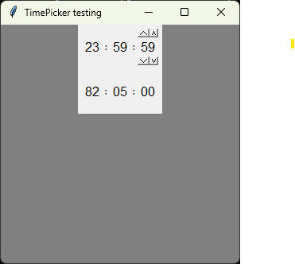

# TimePicker

tkinter widget
Mouse over the numbers to reveal the buttons.

Methods:
```python
TimePicker.__str__()				# -> str: format 'HH:MM:SS'
TimePicker.get_seconds()			# -> int: hours * 3600 + minutes * 60 + seconds
TimePicker.set_value(value: str)	# value format: 'HH:MM:SS'
```

```python
root = tk.Tk()
root.title('TimePicker testing')
root.geometry('300x300+1000+200')
root.configure(bg='grey')
TimePicker(root).pack()
TimePicker(root, hours_limit=99).pack()
root.mainloop()
```


